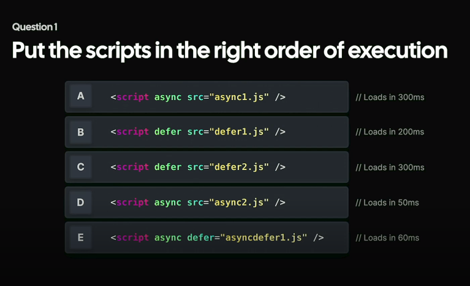
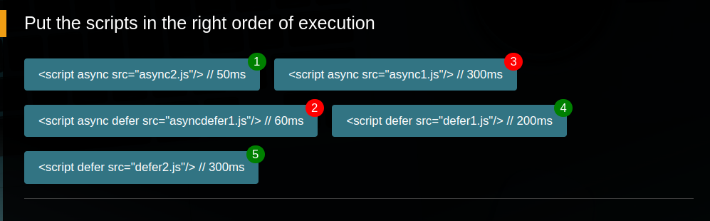
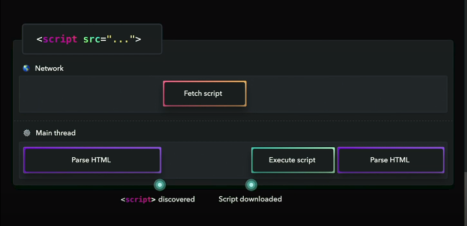
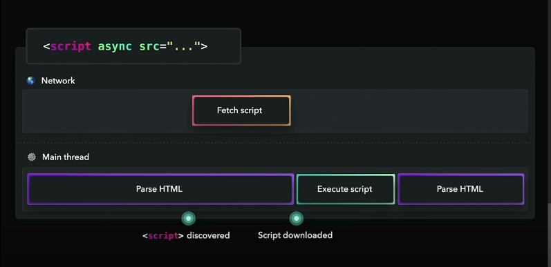
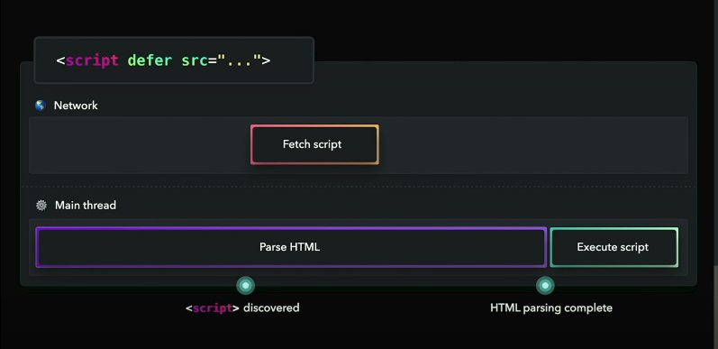
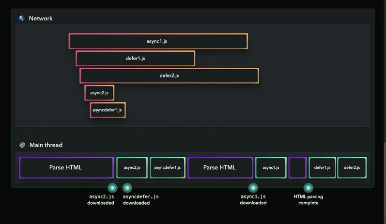

# 'async' & 'defer'

## Answer

## Explanation
#### 1. Normal script tag

When a <b><q>Normal script</q></b> tag is discovered by the HTML parser, it stops the parsing, fetches the script, and once it's downloaded it will execute the script and then it will continue parsing the HTML.
This is called <b>Render Blocking</b>.

#### 2. Script tag with 'async' attribute

When a script tag with <b><q>async</q></b> attribute is discovered by the parser, it still parses the HTML in parallel to fetching the script, but once the script is downloaded, it will stop parsing HTML and it will execute the script, and then it will continue parsing HTML.

Note: With async there is no guarantee that scripts will execute in order. When the script is downloaded it will execute immediately.

#### 3. Script tag with 'defer' attribute

With <b><q> defer</q></b> attribute scripts are fetched asynchronously, but the scripts are executed only once the HTML parsing is completed. The good thing about the defer is that you can guarantee the order of script execution. It is good when you have scripts that depend on each other.

## Explanation to the question

- when there are both 'async' & 'defer', the async will take precedence unless there is no browser support for async.