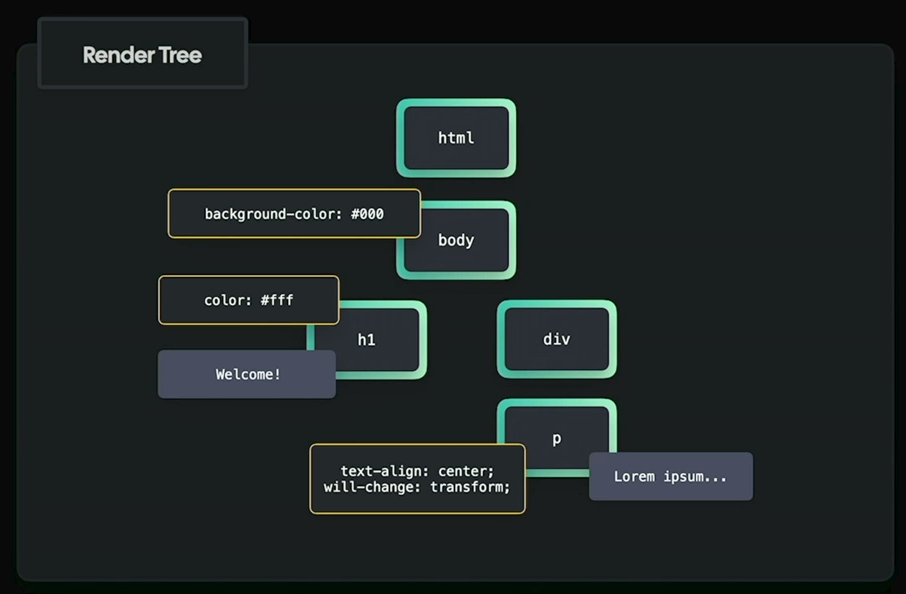

# Rendering Pipeline & Compositing

#### 1. Parse HTML & Generate DOM Tree

#### 2. Parse CSS & Generate CSSOM Tree

#### 3. Render Tree

It creates Render Tree by combining both DOM tree and CSSOM tree,
It only includes the visual elements which we actually see on the screen.
The Render Tree contains both the styles and HTML
- Note: It doesn't include elements like 'head','script', display hidden elements.

#### 4. Layout Process

#### 5. Paint Phase

Paint process assings colors and images to the visual elements in the render tree

#### 6. Composite

Combines all the layers. The Composite process happens on the compositor thread. It's like separate thread in GPU.

#### 7. Display on screen
